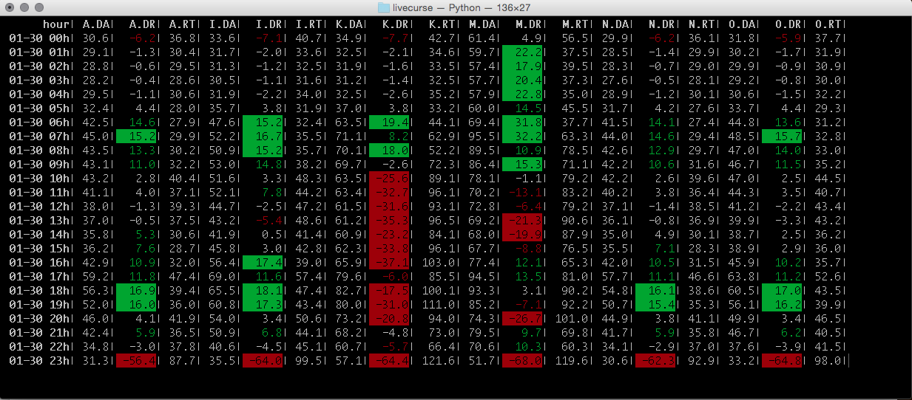

### livecurse 

**livecurse** is a python package to display live data to a terminal using
 the curses package.
 
It uses a **pandas** DataFrame as a container for the data to be presented.

### Features
Data in the DataFrame can be formatted using usual python text formatting. 

The color pairs allowed by curses can be leveraged to highlight data of interest 
using functions to be applied to columns.

### License
GNU General public license

### Documentation
It has yet to be written formally. 
Please see example.py for a complete working example
 
### Requirements
Latest pandas, curses (that must be installed manually if on Windows).
